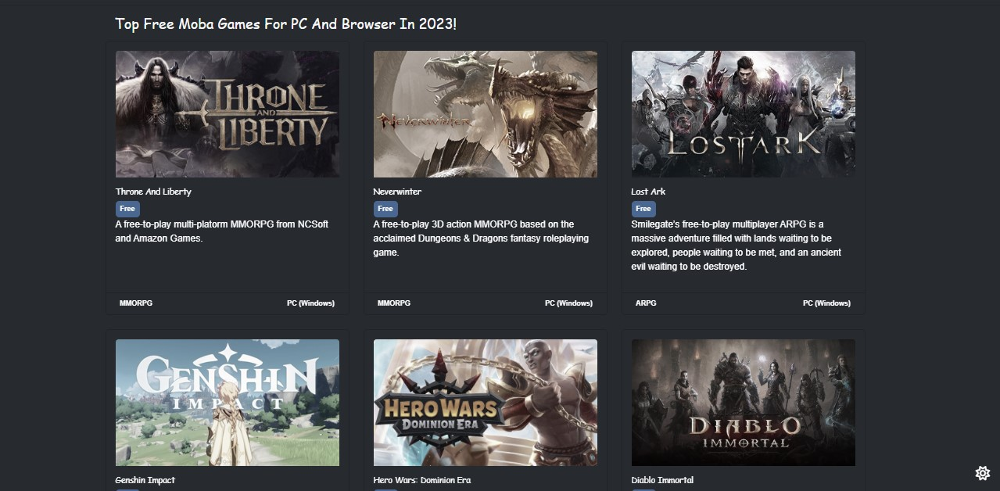
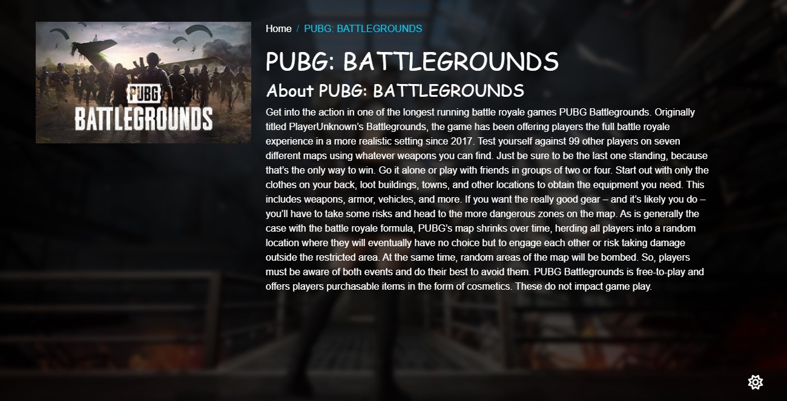

| Technology | Description |
|-------------|-------------|
| 💻 **HTML5** | Structure of the web pages |
| 🎨 **CSS3** | Styling and responsive design |
| ⚡ **JavaScript (ES6)** | Handles logic and interactivity |
| 🌐 **AJAX / Fetch API** | Used for API requests and dynamic updates |

---

## 🚀 Live Demo

🔗 [View Website](https://gameover-app.netlify.app/)  
---
## 📸 Preview


 


## 📦 Installation & Usage

1. **Clone the repository**
 ```bash
   1. git clone https://github.com/alaamarey/GameOver-.git
   2. cd YourProjectName
   3.Open index.html directly in your browser
    No server setup is required

   
📁 Project Structure
project-folder/
│
├── home.html
├── details.html
├── login.html
├── register.html
├── css/
│   └── all.min.css
│   └── bootstrap.min.css
│   └── style.css
├── js/
|  └── bootstrap.bundle.min.js
|  └── home.js
|  └── details.js
|  └── login.js
|  └── register.js
├── webfonts/
|      └── ....
└── images/
    └── ...

